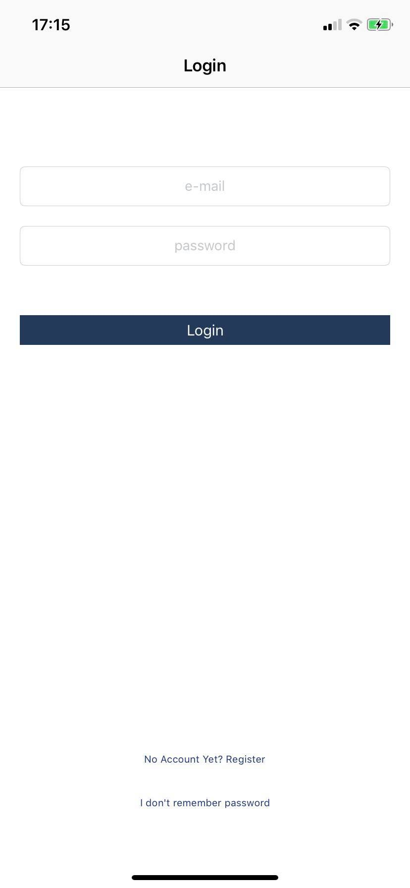
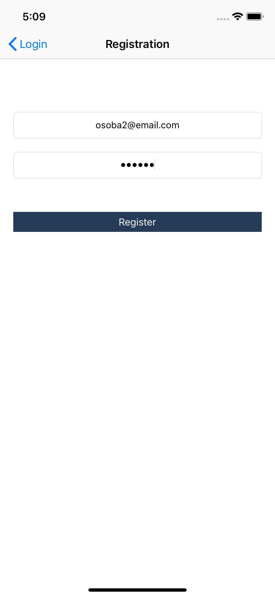
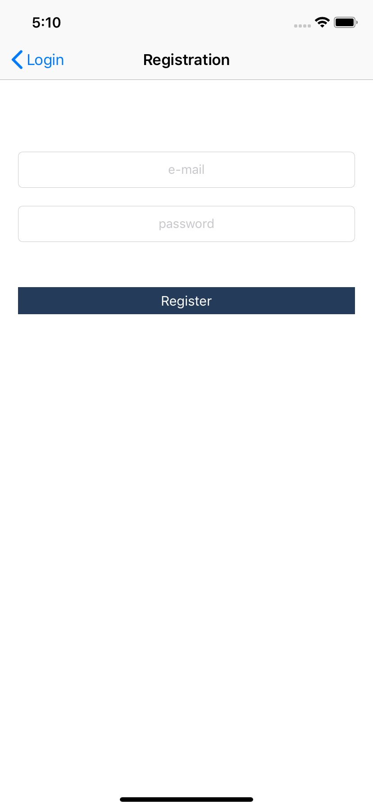
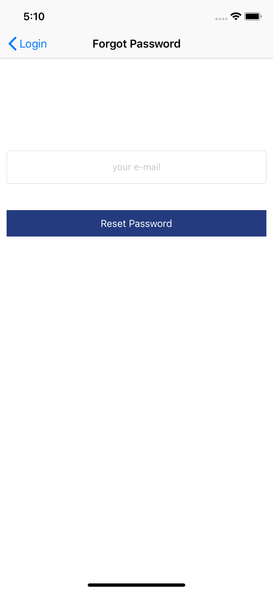
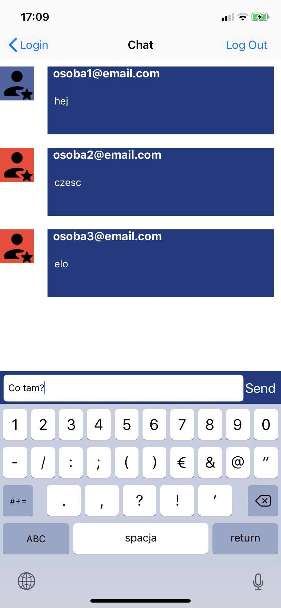

# MessageApp
Simple Message App written in Swift 

## Features 
* Authentication for Google Firebase database using email
* Registration, log in and reset password using email 
* Differentiate current user and other user by changing their avatar colors

## Used technologies
* Swift 4
* AutoLayout (for app layout)
* Google Firebase framework (for online real-time database)
* SVProgressHUD framweork (for displaying simple and clean "progress wheel") 
* ChameleonFramework (for more UI colors)

##### Project Done: July 2019

